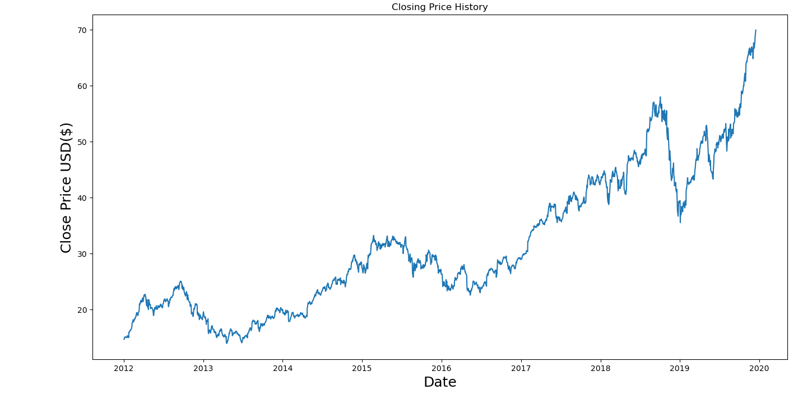
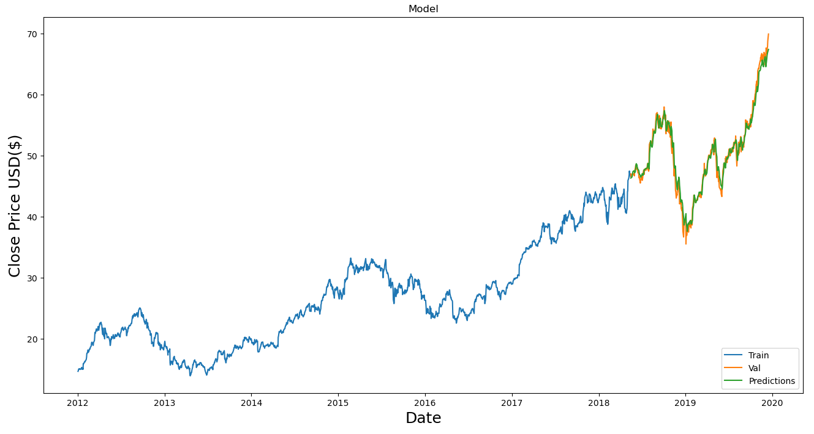

# Stock Market Prediction using LSTM

This project utilizes Long Short-Term Memory (LSTM) neural networks to predict stock market prices based on historical data. The model is designed to capture the sequential dependencies in time-series data, making it well-suited for forecasting trends in stock prices.

## Project Overview

The goal of this project is to predict future stock prices by analyzing historical data. The LSTM model is trained on past stock prices and used to forecast future values. The results are visualized through graphs showing the actual vs. predicted prices.

## Features

- **LSTM Model**: A deep learning model that captures temporal dependencies in stock price data.
- **Data Preprocessing**: Handling missing values, scaling, and splitting data into training and test sets.
- **Visualization**: Graphs comparing actual and predicted stock prices.

## Installation

To run this project locally, follow these steps:

1. Clone the repository:
   ```bash
   git clone https://github.com/your-username/stock-market-prediction.git
   cd stock-market-prediction
   ```

2. Install the required dependencies:
   ```bash
   pip install -r requirements.txt
   ```

## Usage

1. **Data Preparation**: Load and preprocess the stock market data.

2. **LSTM Model Training**: Define and train the LSTM model.
   ```python
   from keras.models import Sequential
   from keras.layers import LSTM, Dense, Dropout

   model = Sequential()

   model.add(LSTM(units=50, return_sequences=True, input_shape=(X_train.shape[1], 1)))
   model.add(Dropout(0.2))

   model.add(LSTM(units=50, return_sequences=False))
   model.add(Dropout(0.2))

   model.add(Dense(units=1))

   model.compile(optimizer='adam', loss='mean_squared_error')
   model.fit(X_train, y_train, epochs=25, batch_size=32)
   ```

3. **Prediction**: Use the trained model to predict stock prices.
   ```python
   predictions = model.predict(X_test)
   predictions = scaler.inverse_transform(predictions)
   ```

4. **Visualization**: Plot the actual vs. predicted prices.
   ```python
   import matplotlib.pyplot as plt

   plt.figure(figsize=(16,8))
   plt.title('Model')
   plt.xlabel('Date',fontsize=18)
   plt.ylabel('Close Price USD($)',fontsize=18)
   plt.plot(train['Close'])
   plt.plot(valid[['Close', 'Predictions']])
   plt.legend(['Train','Val', 'Predictions'],loc='lower right')
   plt.show()
   ```

## Results

Here are the before and after predictions visualized:

- **Before Prediction**: 
- **After Prediction**: 

## Contributing

Feel free to submit pull requests or open issues if you find any bugs or have suggestions for improvements.

## License

This project is licensed under the MIT License - see the [LICENSE](LICENSE) file for details.


